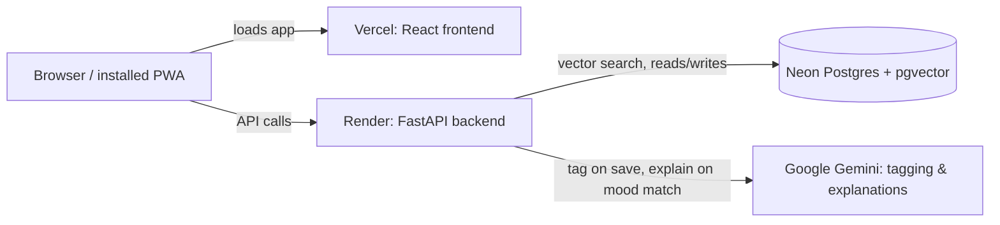

# Quote Vault

A personal app for saving quotes and finding them again by how you're feeling, instead of scrolling through a list.

Live demo: https://quote-vault-rose.vercel.app

## How to use it

It's a personal tool, not a pre-loaded library. It starts empty, and you fill it in with your own quotes.

1. Go to **Save**, paste or type a quote, tap Save. It gets tagged automatically in the background (takes a second or two).
2. Go to **Mood**, type how you're actually feeling ("restless," "burnt out," whatever), and hit enter. It finds the quote you saved that fits, and adds a line on why.
3. **Tags** shows everything you've saved so far, grouped by theme instead of one long list.

It's running on a free-tier Gemini key, so the public demo is rate-limited: expect a "slow down" message if you poke around a lot without being the owner. That's intentional, not a bug.

## Why this exists

I wanted somewhere to keep quotes from stuff I read and actually find them again later, not by remembering which article they came from, but by what they mean. So instead of a keyword search box, the whole app is built around "how am I feeling right now, and is there a quote for that."

## How it works

- **Mood search**: type a feeling, get the closest match from what you've saved, plus a one-sentence explanation of why it fits
- **Auto-tagging**: Gemini reads each quote on save and tags it, reusing tags you already have instead of inventing near-duplicates, so the tag list stays small
- **Tag browse**: quotes grouped by mood/theme instead of a flat grid
- **Paste and go**: paste a quote with the author tacked on after a dash, and it splits that into its own field automatically
- **Installable / offline**: it's a PWA, works offline for anything you've already viewed, and on Android you can share text from any app straight into it
- If Gemini's rate-limited or down for a second, saving and searching both still work; tags/explanations just fall back to something simpler instead of failing outright

## Under the hood



FastAPI + Postgres/pgvector backend on Render, React/Vite frontend on Vercel, Neon for the database. Search is one SQL query: cosine similarity over embeddings plus the tag filter, ranked together, no separate steps. Embeddings run locally with `fastembed` (ONNX, not PyTorch; torch OOMs on Render's free 512MB tier, learned that one the hard way). Gemini only gets called on save and on a mood match, never during search itself, so search speed never depends on the LLM being fast or even up.

## Running it locally

**Backend**
```bash
docker compose up -d          # Postgres + pgvector
cp .env.example .env          # fill in GEMINI_API_KEY
pip install -e ".[dev]"
uvicorn app.main:app --reload
```

**Frontend**
```bash
cd frontend
cp .env.example .env          # VITE_API_BASE_URL=http://localhost:8000
npm install
npm run dev
```

**Tests**
```bash
pytest          # search ranking, embedding pipeline, tagging, rate limiting
ruff check .
```

## About the public deployment

Anyone can try mood/topic search on the live demo, but saving new quotes is locked to me (the owner) via a constant-time-compared access key, otherwise a stranger could fill my own quote collection with junk. Everyone else gets a small daily allowance per IP so the shared Gemini key doesn't get burned through by bots. Details in `app/rate_limit.py` if you're curious how that's wired up.

## License

MIT, see [LICENSE](LICENSE).
